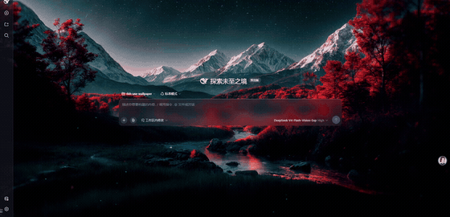
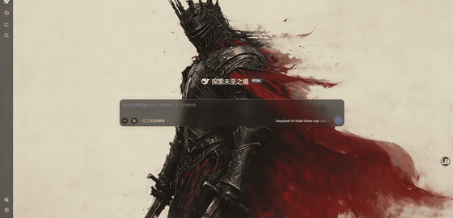

# @dsh-use/wallpaper-engine

[](https://github.com/topics/dsh-plugin)
[](https://github.com/deepseek-ai/deepseek-harness)


**把 Wallpaper Engine 的 scene（场景）壁纸搬进 [DeepSeek Harness](https://github.com/deepseek-ai/deepseek-harness) 的 Web GUI** —— 在浏览器里实时渲染粒子、水波、云卷、布料摆动，让动态壁纸成为你写代码时的背景。

不需要 Wallpaper Engine 在后台运行，不需要 WebGPU，不重新分发任何第三方素材。

---

## 🎬 在 DSH 里的真实效果

下面两段动图都是**在 DSH Web GUI 的真实页面上**录的（不是离线贴图，也不是设计稿）：壁纸由插件在浏览器里实时渲染，DSH 界面叠加在其上。

<table>
<tr>
<td width="50%" align="center">

**Crimson Horizon · 星空雪山**
<sub>Landscape</sub>



<sub>[▶ 完整视频（9s / mp4）](docs/videos/crimson-horizon-dsh.mp4)</sub>

</td>
<td width="50%" align="center">

**Knight in a red cloak · 红披风骑士**
<sub>Anime</sub>



<sub>[▶ 完整视频（9s / mp4）](docs/videos/knight-red-cloak-dsh.mp4)</sub>

</td>
</tr>
</table>

> **录制方式（如实说明）**：两段动图与视频都是在**真实运行的 DSH 页面**上、由本插件的生产构建（`lib/`）实时渲染本机 workshop 壁纸后录制的浏览器画面，未做后期合成；壁纸通过插件自身的切换入口 `window.__wallpaperEngine.select(id)` 切换，因此画面里只有 DSH 界面与壁纸本身。画面已裁掉浏览器地址栏。壁纸素材版权归原作者所有，此处仅作效果展示，不再分发。

---

## ✨ 能做什么

| | 能力 | 说明 |
|---|---|---|
| 🎨 | **Scene 动态壁纸** | 在浏览器里实时算出来，不是静态图贴上去：背景图层与粒子系统各司其职，背景的缩放、透明度、亮度按原作者的设定还原 |
| 🌊 | **粒子效果完整** | 雪、雨、花瓣、火星、雾、气泡等都按壁纸里的原始参数运动：重力、风向、湍流、寿命、颜色与大小渐变 |
| 🖼️ | **各种纹理都能解** | 主流压缩格式（DXT1/3/5、RGBA、R8、RG88）与多帧精灵动画（火把、雾、光晕）都能正确解出原图，不糊、不露黑边 |
| 🎞️ | **视频 / 网页 / 图片壁纸** | 视频循环播放；网页壁纸在沙箱里加载；图片壁纸用预览图 + 缓慢缩放动效 |
| 🧩 | **常见特效会动** | 水波、涟漪、水流、云飘、植物摆动、抖动、脉冲、淡入淡出，以及模糊、泛光、光轴、局部对比度这类需要多趟渲染的特效（少数特效仍然看不到，见下节） |
| 🛡️ | **永不白屏** | 任何壁纸渲染失败，自动退回它的预览图，界面始终可用 |
| ⚙️ | **开箱即用** | 自动探测 Steam 壁纸目录（注册表 + Steam 库配置 + 常见路径），也可手动填写；改设置立刻生效，不用重启 |
| 🚫 | **不依赖运行时** | 不需要 Wallpaper Engine 在后台运行；所需的引擎内置素材在你本机读取，不随插件分发第三方素材 |

> 💬 **换了几张壁纸却发现某张显示不正常？** 那是我们需要知道的——请按下方「使用前请了解」末尾的说明提交 Issue，附上壁纸名称与 ID 即可。

---

## 🚀 快速开始

### 1. 安装插件

**从 GitHub 安装（推荐，最新）**

```bash
dsh plugin --profile web add github:yu502950715yang/dsh-use-wallpaper
dsh plugin --profile web install
```

**从 npm 安装**

```bash
dsh plugin --profile web add "@dsh-use/wallpaper-engine"
dsh plugin --profile web install
```

> 已发布到 npm，最新版本 **[0.4.3](https://www.npmjs.com/package/@dsh-use/wallpaper-engine)**。发布包只含 `lib` + `dist` + `cordis.patch.yml`（构建产物已随包提交，**装完无需本地构建**）。
>
> npm 版与 GitHub 版的差别：npm 走版本发布，**更新节奏慢于仓库 `main`**；想第一时间拿到修复请用上面的 GitHub 方式。

**本地开发（`link:` 符号链接，改码即时生效）**

```bash
# 必须在**本仓库根目录**执行：link:. 会被锚定到当前目录
dsh plugin --profile web add link:E:/code/dsh-use-wallpaper
```

> 仓库根 `package.json` 已声明 `dsh.bundle`，bundle 由 `cordis.patch.yml` 自动注册 —— **不要**手动改 profile 的 `package.json`，也**不要**往 profile 的 `cordis.patch.yml` 插条目（重复 insert 会报 `duplicate loader entry id`）。

### 2. 启用并选择壁纸

1. 重启 `dsh web`，打开 GUI。
2. 进入 **设置 → 侧边栏「Wallpaper 壁纸」**。
3. 填写**壁纸目录（workshop）**与**引擎目录（particle 纹理）**，或点 **自动探测** 采用探测结果。典型路径：
   - 壁纸目录：`D:/Steam/steamapps/workshop/content/431960`
   - 引擎目录：`D:/Steam/steamapps/common/wallpaper_engine`
4. 在缩略图网格中点选壁纸即可生效。

### 3. 验证

- `GET /wallpapers/list` 返回 JSON 壁纸数组。
- 浏览器 Console 出现 `[three] scene loaded id=… background=N particleLayers=M`（`M ≥ 1` 表示粒子层已建）。

---

## 🧰 配置项

设置面板暴露的是**目录与选择**；其余是插件设置字段（可写在 profile `cordis.patch.yml` 的 `config` 中）：

| 字段 | 默认 | 说明 |
|---|---|---|
| `selectedWallpaperId` | 空 | 选中的壁纸（空 = 恢复 DSH 默认背景） |
| `wallpaperDir` | 空 | Steam workshop 壁纸目录 |
| `weAssetsDir` | 空 | Wallpaper Engine 安装目录（读内置粒子/效果纹理） |
| `overlayOpacity` | `0.35` | 壁纸层上方遮罩的不透明度 |
| `blurEnabled` / `blurRadius` | `false` / `12` | 背景模糊与半径 |
| `kenBurns` | `true` | 图片壁纸的缓慢缩放动效 |

优先级：用户设置 > profile `cordis.patch.yml` 的 `config` > 缺省。

> ⚠️ **如实说明**：`overlayOpacity` / `blurEnabled` / `blurRadius` / `kenBurns` 目前**只有设置字段，设置面板里没有对应控件** —— 要调整需走 profile 配置。（此前 README 称「面板里可实时调节」，与代码不符，此处已订正。）

---

## 💡 效果为什么值得期待

- **动态是真的，不是贴图**：粒子会按原作者的设定运动（重力、风向、湍流、寿命、闪烁），水会流动起波纹，云会缓缓飘。不是拿一张静态图做位移。
- **尽量还原原版观感**：混合方式、粒子大小、发光叠加、色调都照着 Wallpaper Engine 的规则来，并以桌面版逐像素对拍校准过。
- **支持格式够全**：主流 scene 壁纸的纹理压缩格式（DXT1/3/5、RGBA、R8、RG88）与多帧精灵动画（火把、雾、光晕）都能解出原图，不会糊成一片或露黑边。
- **高清屏不浪费**：按设备像素比渲染，Retina / 高 DPI 屏上线条依然锐利。
- **出问题也不会砸掉你的界面**：任何一张壁纸渲染失败或算不出可见内容，就自动退回它的预览图（带缓慢缩放动效），**不会白屏、不会黑屏卡死**。
- **换来这些的代价很小**：纯浏览器原生能力 + WebGL，**不需要 Wallpaper Engine 在后台运行**，也不需要 WebGPU。

---

## ⚠️ 使用前请了解

这一节帮你判断**自己的壁纸能不能正常显示**。壁纸库越冷门、效果越复杂，越可能命中下面几条。

> **如果你的壁纸出现异常，请务必拉到本节末尾** —— 那里写了反馈方式。壁纸写法千差万别，你的反馈是项目改进的主要来源。

**画面表现**

- **少数壁纸可能出现黑块或发黑**：带复杂遮罩、或用了特殊背景混合方式的壁纸会有这个现象——那是画面的**局部瑕疵或整体偏暗，不是你没配好**。（本机 28 张壁纸的抽样中命中约十分之一。）
- **模糊、泛光、光轴、局部对比度已在本地实时执行**（最长的泛光链要跑 16 趟），但**能不能看出来取决于壁纸**：这类效果若挂在**文字**或**合成层**对象上就看不到（那类对象本身还没有渲染，与特效引擎无关）；另有极少数（如光轴）目前只确认到它已在本地按写法执行，还没确认到画面上能看出来。
- **粒子的自转没做**：花瓣、雪花的翻滚/倾斜看不到（位置和飘落速度是正常的）。
- **音频响应类壁纸不会随音乐律动**：频谱可视化那条效果目前不生效。
- **应用级光晕（Glow）已实现并默认开启**（设置 → 壁纸 → 「光晕」可关；开关在**切换一次壁纸后**生效）：scene 壁纸的亮部（路灯、霓虹、云边）现在有与桌面版基本一致的光晕（实测云区亮度 p99：关 200 → 开 224，桌面 225），此前"桌面更亮"的主要差异来源即它。**仅 scene 壁纸**：视频 / 图片 / 网页壁纸的亮部仍与桌面有差。**目前只在一张壁纸（GTR）上真机验证过**。**如实标注**：Glow 开启时 base RT 无 MSAA（`samples` 缺省 0），可能影响粒子 billboard / 硬边锐度；**该项未测量**。
- **越大的壁纸越吃显存**：4K 分辨率下单张壁纸可能占用数百 MB 显存。追求省电/流畅可以用小分辨率或选择简单的壁纸。

**环境要求**

- **仅 Windows 实测**，macOS 未测试。
- **需要本机装有 Wallpaper Engine**：插件要从中读取内置的粒子与特效素材。没装或路径没配对时，粒子会退化为纯色圆点（画面仍在，不会白屏）。
- **浏览器需支持 WebGL2**（Chrome / Edge 均可）；**为了更接近 Wallpaper Engine 的效果，推荐使用 Chrome**。不支持 WebGL2 时自动退回预览图。

**发现壁纸有问题？欢迎反馈**

上面几条是已知情况，但壁纸库非常庞杂（每张壁纸都是原作者自己搭的效果，写法千奇百怪），**没被覆盖到的异常一定还有**。如果你发现某张壁纸渲染不对，请提 issue —— 这类反馈是项目最主要的改进来源。

👉 **[提交 Issue](https://github.com/yu502950715yang/dsh-use-wallpaper/issues/new)**

为了能快速定位，麻烦带上这几项（第一项最关键）：

1. **壁纸名称与 Workshop ID** —— 例如「Crimson Horizon，ID `3765967112`」。ID 可以在设置面板的壁纸目录里找到（`workshop/content/431960/<ID>/`）。
2. **现象描述** —— 是整屏黑掉、局部黑块、某个效果不动、粒子消失，还是画面偏色/过暗？
3. **对比信息（如果方便）** —— 同一张壁纸在桌面版 Wallpaper Engine 上的表现（截图对比最好）。有对比就能立刻区分「我们的缺陷」和「原作者的设定」。
4. **环境** —— 浏览器与版本、是否装了 Wallpaper Engine、显示器分辨率。
5. **Console 报错（可选但很有用）** —— 打开开发者工具 Console，搜 `[three]` 或 `[warn]` 相关的行，贴出来。

> 若某张壁纸能稳定复现问题，把它设为**唯一变量**（其他设置保持默认）会让排查快很多。

> 想看实现细节、效果链覆盖率和工程现状（如显存实测、性能门槛状态、未接入的备用路径），见 **[docs/technical-notes.md](docs/technical-notes.md)**。

---

## 🏗️ 架构一览

<sub>面向开发者与贡献者 —— 只想用的话可以跳过这一节。</sub>

<details>
<summary>展开目录结构与渲染回退链</summary>

```
src/host/     Node 侧（Cordis 插件）：扫描壁纸目录、解包 PKGV0001、HTTP 路由、Steam 路径探测、settings
src/client/   浏览器侧（esbuild → dist/client.js），渲染主路径在这里
              ├─ threejs-player.ts    three.js 播放器（背景 Mesh + 粒子 billboard）
              ├─ three-renderer.ts    生产接线（loadSceneToThree + resize/dpr + 材质混合解析）
              ├─ tex-loader.ts        TEXV0005 解码（RGBA/DXT/RG88/R8 + 幂填充裁剪 + sprite 帧 + 行序）
              ├─ object-effects.ts    对象级效果链编排（ObjectEffectStage）
              ├─ effect-runner.ts     效果执行器（uniform 绑定 / 纹理槽 / pass 推进）
              ├─ wasm-renderer.ts     旧 WebGPU 渲染器（**运行时未接入**，保留备用）
              ├─ scene-json / scene-renderer / scene-assets / alignment / visibility  场景解析与几何
              └─ index / wallpaper-controller / background-layer / settings / styles  引导、控制、背景层、设置
src/shared/   跨 host/client 类型（WallpaperInfo、SceneDescription、SceneObject 等）
wasm/         Rust 引擎（wasm-bindgen）：lib / coords / scene / tex / particle / render（备用）
scripts/      build-client.mjs（esbuild 打包 + wasm 复制）
tests/        vitest 单测（node + jsdom 双环境）
docs/         开发配置（dev-setup.md）；设计文档与实施计划（superpowers/*）；技术细节（technical-notes.md）；效果视频（videos/*）
```

**渲染回退链**

```
three.js 播放器（背景图层 + 粒子）
    │ 模块加载/创建失败，或渲染出 0 个可见对象
    ▼
preview 图 + Ken Burns（永不白屏）
```

</details>

---

## 🛠️ 构建与开发

```bash
pnpm install
pnpm run build          # tsc -p tsconfig.json → lib/（host 编译，strict）
pnpm run build:wasm     # cd wasm && wasm-pack build --target web --release --features render → wasm/pkg/
pnpm run build:client   # node scripts/build-client.mjs → dist/client.js
pnpm test               # vitest run（node + jsdom 双环境）
```

- **改过 `wasm/`（Rust）必须先 `build:wasm` 再 `build:client`** —— client 复制的是 `wasm/pkg` 的现成产物，顺序反了会复制旧 wasm。
- **client 侧改动（`dist/`）通常自动热重载**：web profile 始终挂载 `@deepseek-ai/dsh-client-hmr`，轮询 bundle 的 `mtime`/`size` 变化并推 `rebuilt` 帧。
- **host 侧改动（`lib/`）必须重启 `dsh web`**（host 模块热重载默认 `disabled`）。

---

## 🧹 卸载

```bash
dsh plugin --profile web remove "@dsh-use/wallpaper-engine"
dsh plugin --profile web install
# 重启 dsh web
```

---

## 📄 许可与致谢

- 代码：**MIT**。
- 壁纸、纹理等素材版权归原作者 / Wallpaper Engine 所有；本插件只在其上渲染，**不重新分发第三方素材**（WE 内置纹理在运行时从你本机安装目录读取）。
- 格式与行为语义对齐自 [linux-wallpaperengine](https://github.com/Almamu/linux-wallpaperengine) 及开源 Wallpaper Engine 逆向实现。
- README 中的效果视频由本插件的生产渲染代码在本机实测录制，仅用于展示。

---

## 🔗 相关链接

- [GitHub 仓库](https://github.com/yu502950715yang/dsh-use-wallpaper)
- [dsh-plugin 主题页](https://github.com/topics/dsh-plugin)
- [DeepSeek Harness](https://github.com/deepseek-ai/deepseek-harness)
- [开发环境配置（docs/dev-setup.md）](docs/dev-setup.md)
