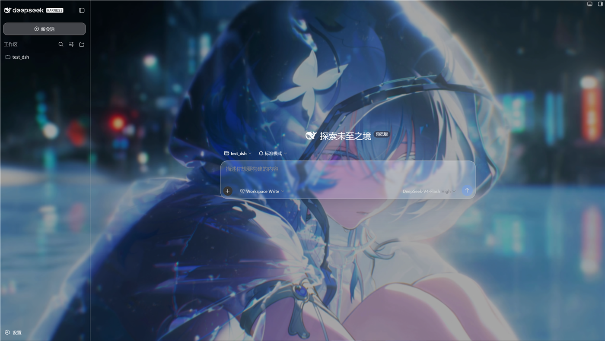
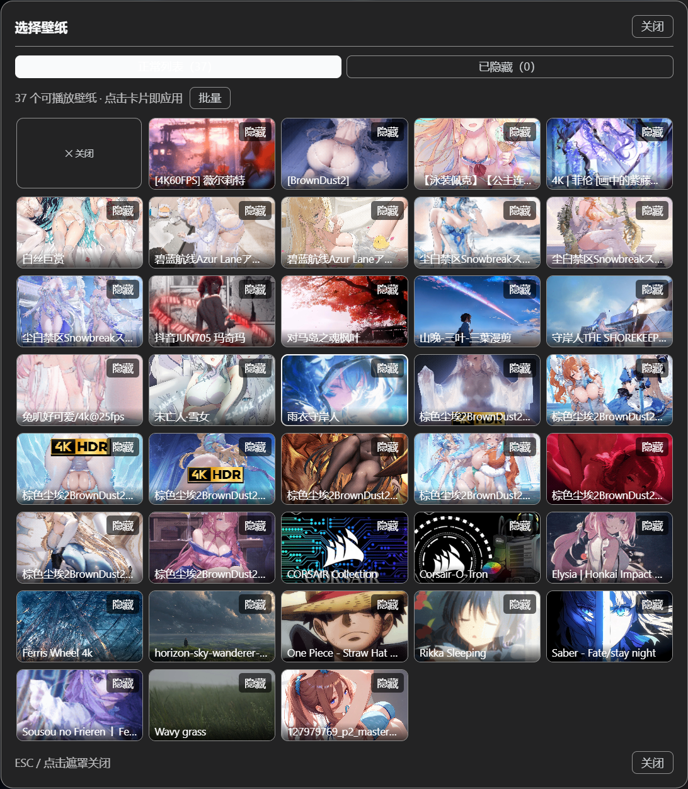

# dsh-plugin-wallpaper-engine

[English](README.en.md) | [中文](README.md)

一个 DSH bundle，把你电脑上的 **Wallpaper Engine** 壁纸变成 **DSH 网页界面（`dsh web`）的背景**。

它会自动发现你本机的 Wallpaper Engine 安装，列出你的壁纸，并把其中*可移植*的类型（Video `.mp4` 和 Web/HTML）渲染到 DSH 对话界面的后方，配以 **iOS 风格液态玻璃**效果。v0.2 起还支持：

- **壁纸选择弹窗**：缩略图网格收纳进独立弹窗，设置页不再被长列表占满；
- **隐藏 / 恢复**：不想看的壁纸一键隐藏（软删除），随时恢复，不碰源文件；
- **视频倍速**：0.5x – 2x 六档原生调速，即时生效、不重载；
- **水平翻转**：镜像画面（视频 / 网页 / 上传图片均适用）；
- **自定义壁纸**：直接上传本地 JPG / PNG / MP4 当壁纸，可选存储位置与画面适配模式。



> 壁纸 + 磨砂遮罩 + iOS 液态玻璃，渲染在 DSH 界面后方。

## 为什么只支持 Video 和 Web 壁纸？

Wallpaper Engine 的壁纸分四种类型：

| 类型 | 由谁渲染 | 能否搬到 DSH |
|---|---|---|
| **Scene（场景）** | Wallpaper Engine 自带的 3D 引擎 | ❌ 不能 — 原生 3D（`.obj`/着色器），只有 WE 能渲染 |
| **Video（视频）** | 就是一个 `.mp4` 文件 | ✅ 能 — 在 `<video>` 标签里播放 |
| **Web（网页）** | WE 内置的 Chromium 壳（`webwallpaper64.exe`）承载 HTML | ✅ 能 — 在 `<iframe>` 里加载 |
| **Application（应用）** | 注入的外部窗口 | ❌ 不能 |

这是 mineradio 以及所有第三方 Wallpaper Engine 集成方案都无法回避的同一限制：只有 *Video* 和 *Web* 两种壁纸可移植。Scene 壁纸仍会列在选择器里（标为 `[不可播放]`），让你知道自己有什么，但没办法拿来做动态背景。

## 工作原理

- **Host 端**（`lib/index.js`）：一个 Cordis 插件，负责
  1. 通过读取 Steam 的 `libraryfolders.vdf` 定位 Wallpaper Engine 安装位置（所以 Steam 装在非默认盘也能用）；
  2. 从 `projects/defaultprojects`、`projects/myprojects` 以及 `steamapps/workshop/content/431960/*` 枚举壁纸；
  3. 在 DSH webserver 上注册同源 HTTP 路由，让浏览器端直接获取数据和流式加载媒体：
     - `GET /wallpaper-engine/inventory` → 壁纸 JSON 列表
     - `GET /wallpaper-engine/media/<token>` → 视频 / HTML（支持 Range）
     - `GET /wallpaper-engine/preview/<token>` → 预览图
     - `POST /wallpaper-engine/upload` → 上传自定义壁纸（JPG / PNG / MP4，原始字节流）
     - `POST /wallpaper-engine/remove` → 移除已上传的壁纸
     - `POST /wallpaper-engine/upload-dir` → 更改上传目录（持久化到 `~/.dsh-wallpaper-engine/config.json`，自动迁移已有文件）
- **Client 端**（`lib/client.js`）：一个浏览器模块，拉取壁纸列表，把选中壁纸渲染到应用三列**后方**的固定图层，并在「设置 → General」里加一个「Wallpaper Engine」行（含选择弹窗、隐藏/恢复、倍速/翻转与自定义壁纸管理）。
- **自定义壁纸存储**：上传的文件写入插件管理的本地目录（默认 `~/.dsh-wallpaper-engine/uploads`，可在设置里改到任意盘符），经同一套 `/media`、`/preview` 路由服务——与 WE 媒体走完全相同的管道，天然跨重启持久、无浏览器配额限制。

## 安装

### 普通用户（安装已发布版本，推荐）

如果你只是想用这个插件，直接装 npm 上已发布的包即可：

```sh
dsh plugin --profile web add dsh-plugin-wallpaper-engine
```

装完重启 `dsh web`，打开 **设置 → General → Wallpaper Engine** 就能用。

> **macOS 用户**：macOS 没有 Wallpaper Engine 客户端，本插件的 macOS 版（WaifuX + 散装媒体支持）由社区维护者 Jerry 维护，发布为独立 npm 包：
>
> ```sh
> dsh plugin --profile web add dsh-plugin-wallpaper-engine-mac
> ```
>
> 仓库：https://github.com/ruijiaang-lab/dsh-wallpaper-engine

### 开发者（运行你本地的一份代码）

**大多数读者可以跳过本节。** 只有当你打算自己改这个插件的代码时才需要。下面的步骤假定你已了解命令行、以及「仓库 / repository」是什么（一份用 Git 做版本管理的代码文件夹）。

**第 1 步：取得源码（checkout）**

> 这里 *checkout* 的意思很简单：就是「把源代码下载/复制一份到你电脑的某个文件夹里」。通常在这个 GitHub 页面点 **Code → Download ZIP** 下载并解压，或用 Git 克隆：
>
> ```sh
> git clone https://github.com/elysia395/dsh-wallpaper-engine.git
> ```
>
> 完成后你会得到一个包含 `package.json`、`lib/`、`src/`、`cordis.patch.yml` 的文件夹。下文把这个文件夹称作**插件文件夹**。

**第 2 步：用文件夹路径安装（link:）**

> 这里的 *`link:`* 表示：告诉 `dsh`（它会把命令转发给 pnpm）去**连接你本地那个插件文件夹**，而不是从网上下载一个包。好处是：你改完代码并重新构建后，改动能直接生效，不用反复重装。

把下面命令里的 `<插件文件夹绝对路径>` **替换成你插件文件夹的完整路径**（就是你在资源管理器/文件管理器里打开那个文件夹时，地址栏显示的那串路径）：

```sh
dsh plugin --profile web add link:<插件文件夹绝对路径>
```

**具体示例**——假设你的插件文件夹路径像 `D:\dev\dsh-wallpaper-engine` 这样：

```sh
dsh plugin --profile web add link:D:\dev\dsh-wallpaper-engine
```

如果你已经用命令行 `cd` 到了插件文件夹的上一级，也可以用相对路径：

```sh
dsh plugin --profile web add link:./dsh-wallpaper-engine
```

> **该填哪个确切的路径？** 必须是**包含 `package.json` 的那个文件夹**——不是 `package.json` 文件本身的路径，也不是它里面任何单个文件的路径。它就是你在资源管理器地址栏里打开那个文件夹时显示的那串路径。

> 为什么推荐 `link:` 而不用 `file:`？`link:` 是和你的源码文件夹**建立实时连接**，改完 `src/client.js` 并 `npm run build` 后直接生效，无需重装；`file:` 则是打包成一份静态快照，每次改动都要重新 add。首次安装两者都可以。

然后重启 `dsh web`。host 端会成为 bundle 层，client 端会自动加载（`dsh.client.immediately: true`）。

如果 Steam 装在非标准位置，host 会通过 `libraryfolders.vdf` 自动探测，无需额外配置。

## 使用

1. 打开 `dsh web`，进入 DSH 界面。
2. 打开 **设置 → General**，找到 **Wallpaper Engine** 行。
3. 点击 **选择壁纸** 打开选择弹窗，在缩略图网格里点选一张 Video/Web 壁纸（或上传的图片/视频），它会出现在界面后方；点遮罩、按 ESC 或点「关闭」收起弹窗。Scene/Application 无法内嵌网页，不显示在网格中。
4. 用 **暂停/播放** 暂停视频壁纸，用 **关闭** 清除壁纸。
   选择会保存在浏览器的 `localStorage`（键 `dsh-wallpaper-engine:selection`）中。


> 设置界面：当前壁纸卡片、「自定义壁纸」「轮播列表」「壁纸效果」四个分区。



> 选择弹窗：浏览全部壁纸缩略图，支持批量隐藏与已隐藏恢复。

### 隐藏与恢复（软删除）

每张壁纸卡片右上角有「隐藏」按钮——只是从列表移除，**不删除任何源文件**。需要时在弹窗的「已隐藏」标签里单张**恢复**或**全部恢复**；弹窗工具栏的「批量」进入多选模式，可一次隐藏多张。隐藏状态保存在浏览器 `localStorage`，刷新 / 重启不丢；隐藏当前正在播放的壁纸不会打断播放，自动轮转也会跳过被隐藏的壁纸。

### 视频倍速与水平翻转

选中视频壁纸后，「壁纸效果」区出现 **倍速** 档位（0.5x / 0.75x / 1x / 1.25x / 1.5x / 2x）——基于浏览器原生 `playbackRate`，即时生效、不重载不黑屏（壁纸视频本就静音，无需担心音画同步）。**水平翻转** 开关对视频、网页与上传的图片/视频都生效，镜像通过 CSS `scaleX(-1)` 完成，零主线程开销。

### 自定义壁纸

在「自定义壁纸」区可以上传本地图片（JPG / PNG）或视频（MP4）作为壁纸：

- **存储位置**：上传文件默认保存在 `~/.dsh-wallpaper-engine/uploads`（用户主目录，通常是 C 盘）。点「更改」可把存储位置改到任意盘符（绝对路径，支持 `~`），已有文件会自动迁移过去，选择会持久化、重启不丢——不想让壁纸数据占 C 盘的用户建议改到其他盘。
- **格式限制**：仅 JPG / PNG / MP4；浏览器与宿主端双重校验，格式不符会给出明确提示。
- **适配模式**：覆盖 / 填充 / 居中 / 拉伸 四种画面适配（仅对自定义壁纸生效，WE 壁纸保持原设计构图）。
- **管理**：已上传列表可单独**移除**（二次确认后删除本地文件）；上传的壁纸同样支持隐藏 / 恢复、倍速与翻转。
- **重复去重**：重复上传同一文件会自动识别（按内容校验），直接选择已有的那张，不会在仓库里堆积副本。

### 自动轮转（轮播列表）

轮转基于**自定义轮播列表**（轮播列表）。用 **新建** 可以创建任意多个列表，从库存里勾选 Video/Web 壁纸加入每个列表，并为每个列表单独设置**切换间隔**（1、5、10、30、60 或 120 分钟）和**播放顺序**（顺序/随机），勾选 **自动轮转** 后只在该列表内循环。列表保存在浏览器 `localStorage`，完全在客户端维护——轮转不再依赖 Wallpaper Engine 自己的 `config.json` 播放列表路径。

每个列表至少需要 2 个可播放壁纸；手动切换壁纸会重新计算下一次轮转时间；不同列表可以有不同的间隔（比如一个每 5 分钟、一个每 30 分钟）。首次使用时，插件会自动把第一个可播放的 WE 播放列表导入成一个轮播列表，开箱即用；编辑列表时也可以用 **从 WE 播放列表导入** 把其它播放列表导入当前编辑的列表。Scene 和 Application 壁纸不能嵌入网页，会自动从轮转候选和选择器中剔除。

### 四个滑动条

壁纸激活后，四个滑动条可以微调它与界面的融合效果：

| 滑动条 | 作用 | 范围 | 默认 |
|---|---|---|---|
| **壁纸模糊** | 模糊壁纸本身 | 0–60 px | 0 |
| **暗化** | 加深壁纸与文字之间的遮罩 | 0–90 % | 25 % |
| **边框** | 提高边框 / 分割线的对比度 | 0–90 % | 35 % |
| **玻璃** | 玻璃面板（输入栏、气泡）的模糊半径 | 0–40 px | 24 |

> **浅色 / 深色模式的适配提醒** — 每张壁纸的色系和明暗差异很大，**没有哪一种模式能适配所有壁纸**。请在 DSH 的「浅色 / 深色」主题之间来回切换，找到适合当前壁纸的那一种。如果在偏亮或花纹复杂的壁纸上 **文字或分割线看不清**，就把 **暗化**、**边框** 两个滑动条调高（必要时再稍微加一点 **壁纸模糊**），直到看着舒服为止。四个滑动条都是即时生效的，**无需刷新页面**。

## 配置

本插件不会向模型暴露任何工具或提示文本，对 agent 零 token 开销。选择、隐藏、轮播列表等状态都保存在浏览器 `localStorage`，不写入任何持久化 DSH 设置。唯一的本地落盘数据是**自定义壁纸文件**（存于你设置的上传目录）与记录该目录位置的 `~/.dsh-wallpaper-engine/config.json`（约百字节）。

## 与 dsh-better-sidebar 的兼容适配

本插件的液态玻璃效果对 dsh-better-sidebar 的侧边栏面板做了专门适配（毛玻璃、高光与层级统一），让侧边栏与对话区共享同一套「壁纸 + 遮罩」背景，三列视觉一致、不再割裂。


## 已知限制

- Scene（原生 3D）和 Application 壁纸无法内嵌，不会显示在缩略图选择器和轮播候选中；它们的动态渲染仍是 Wallpaper Engine 在桌面上的工作。
- 浏览器需能自动播放静音 `<video>`（DSH 跑在 loopback，现代浏览器允许静音自动播放）。
- 媒体从你本机的 Wallpaper Engine 安装路径提供；host 只提供它已枚举过的文件，不会暴露任意文件系统。自定义上传的文件同样只存在于本机，不上传任何服务器。
- 选择器文案为中英混合（本 bundle 尚未接入 DSH 的 locale 命名空间）。

## 开发 / 重建

host 端（`lib/index.js`）是纯 ESM，无需构建。client 端（`lib/client.js`）是**编译产物**，由规范源文件 `src/client.js` 经 `scripts/build-client.mjs` 生成，输出 DSH 模块加载器要求的 `window.__ModuleLoader__.load({ id, factory })` 外壳（与盒内 client 包 `tsdown` 产出的形态一致）。

```sh
npm run build      # 从 src/client.js 重新生成 lib/client.js
npm run verify     # 物化生成的 bundle 并断言其导出
```

编辑 `src/client.js` 后运行 `npm run build`，不要手改 `lib/client.js`。`npm install`/`pnpm install` 会自动触发 `prepare` → `build`，因此全新 checkout 总是带最新的 `lib/client.js`。

host↔browser 的契约是同源 HTTP，两端可独立开发：改 host 后重启 `dsh web` 生效，改 client 则先 `npm run build` 再重启 `dsh web`。
